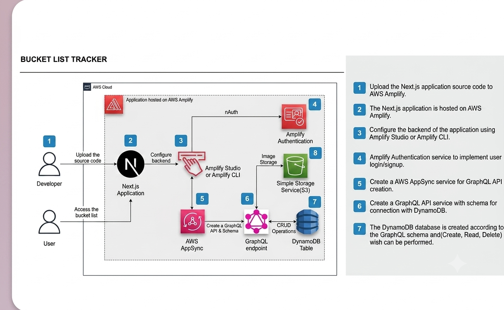

# 🪣 Bucket List Tracker

> A full-stack serverless web application built to understand the fundamentals of modern cloud architecture — authentication, GraphQL APIs, NoSQL databases, file storage, and CI/CD pipelines — all on AWS.

Built by an undergraduate student as a hands-on learning project. Every layer was chosen deliberately to cover one fundamental of cloud development.

---

## 🌐 Live Demo

> The application was fully deployed and tested on AWS Amplify. After confirming all features worked end to end, the AWS resources were removed to manage free tier credits responsibly.
>
> Full source code, architecture, and documentation are available below.

📝 **Full Article on Medium** → [Read the complete step-by-step guide](https://medium.com/@induwaranethmal1322/from-local-to-cloud-how-i-built-and-deployed-a-full-stack-aws-application-as-an-undergraduate-c03de1686afb)
💻 **GitHub Repository** → [MaskINB/bucket-list-tracker](https://github.com/MaskINB/bucket-list-tracker)

---

## 🏗️ Architecture

```
Developer → Git Push → GitHub → AWS Amplify (CI/CD)
                                      ↓
                              Next.js App (SSR)
                                      ↓
                    ┌─────────────────┼─────────────────┐
                    ↓                 ↓                 ↓
              Cognito Auth      AppSync API          S3 Storage
                                      ↓
                                 DynamoDB
                                      ↑
User → Browser → Amplify URL → Next.js → All AWS Services
```

```

```

## ✨ Features

- 🔐 **User Authentication** — Sign up, sign in, email verification via Amazon Cognito
- ➕ **Add Bucket List Items** — Title, description, category, priority, target date
- 📷 **Image Upload** — Attach a photo to each goal, stored in Amazon S3
- ✅ **Mark Complete** — Check off goals with a satisfying completion toggle
- 📊 **Progress Tracking** — Visual progress bar showing percentage completed
- 🔍 **Search** — Real-time search filtering across all your items
- 🗂️ **Filter Tabs** — View All / Active / Completed items
- ↕️ **Sort Options** — Sort by Newest, Oldest, Priority, or A-Z
- 🗑️ **Delete Items** — Remove goals with a confirmation prompt
- 📱 **Responsive Design** — Works on desktop and mobile

---

## 🛠️ Tech Stack

### Frontend
| Technology | Version | Purpose |
|-----------|---------|---------|
| Next.js | 14 | React framework with App Router + SSR |
| TypeScript | 5 | Type safety across entire codebase |
| Tailwind CSS | 3 | Utility-first styling |

### AWS Backend (Serverless)
| Service | Purpose |
|---------|---------|
| AWS Amplify Gen 2 | Hosting, CI/CD pipeline, IaC |
| Amazon Cognito | User authentication and session management |
| AWS AppSync | Managed GraphQL API |
| Amazon DynamoDB | NoSQL database for bucket list items |
| Amazon S3 | Object storage for user-uploaded images |
| AWS CDK | Infrastructure as Code (TypeScript) |
| AWS CloudFormation | Stack management |

### DevOps
| Tool | Purpose |
|------|---------|
| Docker | Containerization for local development |
| Docker Compose | Multi-container local setup |
| GitHub | Version control |
| AWS Amplify CI/CD | Automatic deployment on push |

---

## 📁 Project Structure

```
bucket-list-tracker/
│
├── amplify/                        ← AWS backend (Infrastructure as Code)
│   ├── auth/
│   │   └── resource.ts             ← Amazon Cognito configuration
│   ├── data/
│   │   └── resource.ts             ← AppSync GraphQL schema + DynamoDB
│   ├── storage/
│   │   └── resource.ts             ← S3 storage configuration
│   └── backend.ts                  ← Connects all AWS services
│
├── src/
│   ├── app/                        ← Next.js App Router pages
│   │   ├── layout.tsx              ← Root layout
│   │   ├── page.tsx                ← Home (auth redirect)
│   │   ├── login/
│   │   │   └── page.tsx            ← Sign in page
│   │   ├── signup/
│   │   │   └── page.tsx            ← Create account (2-step)
│   │   └── dashboard/
│   │       └── page.tsx            ← Main application
│   │
│   ├── components/                 ← Reusable React components
│   │   ├── Navbar.tsx              ← Top navigation with sign out
│   │   ├── BucketItem.tsx          ← Single item card with image
│   │   ├── AddItemForm.tsx         ← Create new item form
│   │   └── ImageUpload.tsx         ← S3 image upload with progress
│   │
│   └── lib/                        ← Utility functions
│       ├── amplify.ts              ← Amplify configuration
│       ├── dataClient.ts           ← Generated GraphQL client
│       └── rateLimit.ts            ← Login rate limiting
│
├── Dockerfile                      ← Multi-stage Docker build
├── docker-compose.yml              ← Local development setup
├── amplify.yml                     ← Amplify CI/CD build config
├── next.config.ts                  ← Next.js + security headers
├── tailwind.config.ts              ← Tailwind configuration
├── tsconfig.json                   ← TypeScript configuration
└── package.json                    ← Dependencies
```

---

## 🚀 Getting Started

Make sure you have these installed:

```
Node.js        v20+
Docker Desktop Latest
AWS CLI        Latest (configured)
Git            Latest
```

You also need:
- AWS Account (free tier is enough)
- GitHub account
- IAM user with `AdministratorAccess` policy

### 1. Clone the repository

```bash
git clone https://github.com/MaskINB/bucket-list-tracker.git
cd bucket-list-tracker
```

### 2. Install dependencies

```bash
npm install --legacy-peer-deps
```

### 3. Configure AWS credentials

```bash
aws configure
```

```
AWS Access Key ID     → your-access-key
AWS Secret Access Key → your-secret-key
Default region        → ap-southeast-1
Output format         → json
```

Verify connection:
```bash
aws sts get-caller-identity
```

### 4. Bootstrap AWS CDK (one-time setup)

```bash
npx cdk bootstrap aws://YOUR_ACCOUNT_ID/YOUR_REGION
```

> This is a one-time step per AWS account per region. You never need to repeat it.

### 5. Initialize Amplify Gen 2

```bash
npm create amplify@latest
```

### 6. Start the Amplify sandbox

```bash
# Terminal 1 — keep this running
npx ampx sandbox
```

Wait for:
```
✅ Deployment completed
File written: amplify_outputs.json
```

### 7. Run the development server

```bash
# Terminal 2
npm run dev
```

Open [http://localhost:3000](http://localhost:3000)

### 8. Run with Docker

```bash
docker-compose up --build
```

Open [http://localhost:3000](http://localhost:3000)

---

## ☁️ Deploy to AWS Amplify

### 1. Push to GitHub

```bash
git add .
git commit -m "Initial commit"
git remote add origin https://github.com/YOUR_USERNAME/bucket-list-tracker.git
git branch -M main
git push -u origin main
```

### 2. Connect to AWS Amplify

1. Go to [AWS Amplify Console](https://console.aws.amazon.com/amplify)
2. Click **"Create new app"**
3. Select **GitHub** → authorize access
4. Select your repository and `main` branch
5. Amplify auto-detects Next.js settings
6. Click **"Save and deploy"**

### 3. Automatic deployments

Every push to `main` triggers an automatic redeployment:

```bash
git add .
git commit -m "Update feature"
git push
# → Amplify automatically redeploys ✅
```

---

## 🔐 Security Features

| Feature | Implementation |
|---------|---------------|
| Password policy | Min 12 chars, uppercase, lowercase, number, symbol |
| Login rate limiting | 5 attempts max, 15 minute lockout |
| HTTP security headers | X-Frame-Options, CSP, HSTS, XSS Protection |
| Per-user S3 isolation | Images stored under `bucket-items/{userId}/` |
| Owner-based authorization | DynamoDB filtered at database level via `allow.owner()` |
| Session timeout | Auto sign-out after 30 minutes of inactivity |

---

## 🐛 Common Issues and Fixes

### Issue 1: "Pkg: Error reading from file" on Windows
```bash
# ❌ Don't use
ampx --version

# ✅ Use instead
npx ampx --version
```

### Issue 2: "Region has not been bootstrapped"
```bash
npx cdk bootstrap aws://YOUR_ACCOUNT_ID/YOUR_REGION
```

### Issue 3: TypeScript error — "Property does not exist on ModelTypes"
```typescript
// ❌ Wrong
import type { Schema } from '@/../../amplify/data/resource';

// ✅ Correct
import type { Schema } from '../../amplify/data/resource';
```

### Issue 4: npm ci sync error on Amplify build
```bash
# Regenerate lock file locally
npm install --legacy-peer-deps

# Commit the updated lock file
git add package-lock.json
git commit -m "Fix package-lock.json"
git push
```

### Issue 5: amplify_outputs.json not found
```bash
# Run sandbox to regenerate it
npx ampx sandbox
```

### Issue 6: Missing bucket name on S3 upload
```bash
# Verify S3 bucket was created
aws s3 ls | findstr bucket

# Wait for sandbox to finish redeploying after
# saving amplify/storage/resource.ts
```

---

## 📊 Data Model

```typescript
BucketItem {
  id:          string     // auto-generated
  title:       string     // required
  description: string     // optional
  category:    string     // TRAVEL | ADVENTURE | LEARNING | 
                          // FOOD | FITNESS | CREATIVE | OTHER
  isCompleted: boolean    // default: false
  imageKey:    string     // S3 path to uploaded image
  targetDate:  string     // optional target completion date
  priority:    string     // LOW | MEDIUM | HIGH
  owner:       string     // auto-set to Cognito user ID
  createdAt:   string     // auto-generated
  updatedAt:   string     // auto-generated
}
```

## 🧠 Key Learnings

```
1. Serverless architecture    — No servers to manage, AWS handles scaling
2. GraphQL vs REST            — GraphQL lets the client request exactly what it needs
3. Infrastructure as Code     — Define AWS resources in TypeScript, not console clicks
4. Owner-based authorization  — Filter data at database level, not frontend level
5. CDK bootstrapping          — One-time setup required per region before first deploy
6. npm ci vs npm install      — ci is strict (requires synced lock file), install is flexible
7. Sandbox vs production      — Two separate environments, do not run both simultaneously
8. Per-user S3 paths          — Use identity ID in path for automatic access isolation
```

---

## 🔗 Related Projects

| Project | Tech Stack | Article |
|---------|-----------|---------|
| CI/CD Pipeline with GitHub Actions | Docker + GitHub Actions + AWS EC2 |
| Bucket List Tracker (this project) | Next.js + AWS Amplify + AppSync + DynamoDB + S3 | [Read on Medium](https://medium.com/@induwaranethmal1322/from-local-to-cloud-how-i-built-and-deployed-a-full-stack-aws-application-as-an-undergraduate-c03de1686afb) |

---

## 📚 Resources

- [AWS Amplify Gen 2 Documentation](https://docs.amplify.aws)
- [AWS AppSync Documentation](https://docs.aws.amazon.com/appsync)
- [Amazon Cognito Documentation](https://docs.aws.amazon.com/cognito)
- [Next.js Documentation](https://nextjs.org/docs)
- [AWS CDK Documentation](https://docs.aws.amazon.com/cdk)
- [Docker Documentation](https://docs.docker.com)

---

<div align="center">

**⭐ If this project helped you learn something, please give it a star! ⭐**

Built with ❤️ as part of an undergraduate cloud learning journey

</div>
